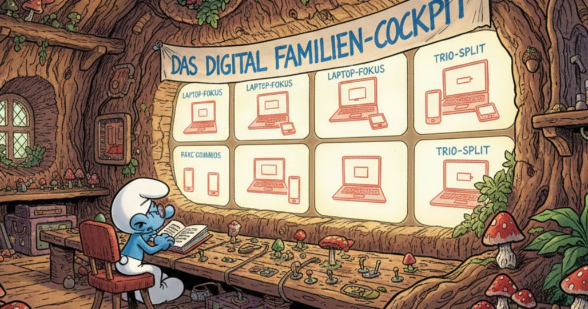
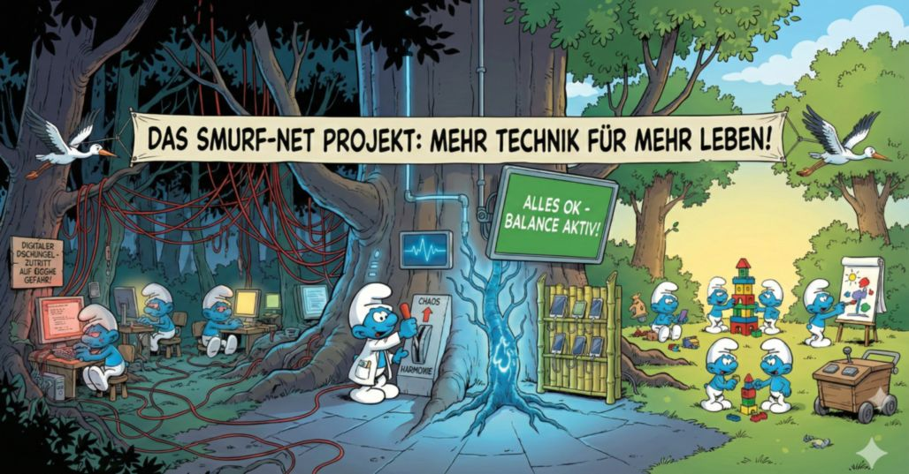

# X-Family Dashboard, v0.9 (beta)
### Alle Bildschirme von Handys und Laptops sicher im Blick – auf einem Monitor.

Dieses Projekt hilft Eltern dabei, die digitale Übersicht im Haushalt zu behalten. Es vereint die Bildschirme von bis zu 8 Handys und 8 Laptops auf einem zentralen Monitor, damit nichts im Verborgenen bleibt.

## 📋 Was dieses Cockpit für dich tut
* **Alles auf einem Blick:** Zeigt alle aktiven Geräte gleichzeitig in einer geordneten Ansicht an.
* **Automatische Ordnung:** Das System erkennt selbstständig, wie viele Geräte gerade an sind, und ordnet sie perfekt auf dem Schirm an (9 Basis-Szenarien).
* **Selbstheilung:** Behebt bekannte Netzwerkprobleme (wie das "WLAN-Fragezeichen" unter Zorin OS) automatisch im Hintergrund.
* **Privatsphäre:** Alle Daten bleiben in deinem eigenen Netzwerk (VPN) und gehen nicht über fremde Server.

## 🛠️ Was du brauchst
* **Zentraler PC:** Ein Rechner mit Zorin OS (unser Monitor-Zentrum).
* **Endgeräte:** Handys (Android) und Kinder-Laptops (Zorin OS).
* **Netzwerk:** Eine stabile VPN-Verbindung (z.B. MyFRITZ/DuckDNS), damit alles sicher bleibt.

## 🚀 Schnellanleitung (Installation)

### 1. System-Basis & Software-Installation
Installiere die Kern-Komponenten auf dem Zentral-PC (Zorin OS):
<pre><code>sudo apt update && sudo apt install -y scrcpy adb xtightvncviewer wmctrl tailscale remmina</code></pre>

### 2. Sicherheits-Infrastruktur (VPN & DynDNS)
* **Verbindung:** Ein Site-to-Site VPN koppelt die Router direkt, sodass ADB (5555) und VNC (5900) nur intern erreichbar sind.
* **Handy-Vorbereitung:** Wireless Debugging am Handy einschalten und einmalig per USB initialisieren: `adb tcpip 5555`.

### 3. Remote-Desktop: Das VNC-Setup
* **Auf Kinder-Laptops:** `sudo apt install x11vnc`, Passwort mit `vncpasswd` vergeben und Autostart einrichten: `x11vnc -forever -usepw -display :0`.
* **Auf dem Zentral-PC:** Anzeige via `Remmina` oder `xtightvncviewer`.

### 4. Startprogramme & Helfer (Autostart)
Um das Netzwerk-Fragezeichen in Zorin OS zu beheben, erstelle diesen Autostart-Eintrag:
<pre><code>cat &lt;&lt; 'EOF' &gt; ~/.config/autostart/vpn-heiler.desktop
[Desktop Entry]
Type=Application
Name=VPN Auto-Heiler
Exec=bash -c "sleep 20 && nmcli connection down wg0; sleep 2 && nmcli connection up wg0"
X-GNOME-Autostart-enabled=true
EOF</code></pre>

## ⚖️ Die Goldenen Regeln des Systems
* **Die 101-Regel:** Fenster kehren aus dem Parkplatz immer auf die Position `y=101` zurück, um die Systemleisten zu schützen.
* **Der Parkplatz:** Inaktive Fenster werden automatisch auf 300x300 verkleinert und gestapelt.
* **Krisenvorsorge:** Im BIOS ist "Restore on AC Power Loss" auf **[Power On]** gestellt, damit das System nach einem Stromausfall selbstständig startet.
* **Der Service-Desk:** Technische Manipulation führt zur Abgabe des Geräts in der physischen Schublade (siehe [Hardware Service Desk](./hardware-service-desk/README.md)).

---

## 🗄️ Hardware Sub-Projekt: Service Desk & Balkondurchreiche

Wenn reine Software-Sperren und digitale Limits zu Diskussionen führen, greift die unmissverständliche, analoge Schnittstelle:

> **Hardware Service Desk (Physische Durchreiche & Verwahrung)**  
> Zur physischen Verwahrung von Handies dient die nachbarschaftliche Balkon-Durchreiche mit integriertem Sichtschutz und einem Vogelhäuschen.

* **Eigener Projektbereich:** Vollständige Baudokumentation, Materiallisten und 50+ Detailfotos findest du im Unterordner **[`hardware-service-desk/`](./hardware-service-desk/README.md)**.
* **Zwei-Wege-Ladeschublade:** Kontaktlose Abgabe und gesicherte Verwahrung mittels unsichtbarer Magnetschlüssel-Verriegelung.
* **CAD & Fertigung:** Inklusive 3D-SketchUp-Modell (`.skp`), Onshape-Laserblech-Plänen und wetterfester Geländerklemmen ohne Bohren.
* **Meshcore-Node:** Unauffällige Integration eines autarken [Meshcore](https://www.meshcore.io)-Funkknotens im Vogelhaus-Aufsatz.
* **Video-Demonstration:** [Basisfunktion ansehen](https://youtu.be/EO7W-KcHg_o) | [Mechanik von unten ansehen](https://youtu.be/3OLYUpjaIk4)

👉 **[Zur vollständigen Hardware-Dokumentation & Bildergalerie](./hardware-service-desk/README.md)**

---

## 🖼️ Printscreens
Optische Übersicht, wie das Dashboard die Geräte anordnet:

*Bild 1: Übersicht der Basis-Szenarien und Zyklen.*

*Bild 2: Der Familien-Monitor im Einsatz. Eltern sehen in Echtzeit, was auf den Geräten geschieht.*

*Bild 3: Neue Handies (od. Handy nach Reboot) einmal ans USB-Kabel anschliessen, und das Gerät wird vom System erkannt.*

*Bild 4: Smurf-Net.*

*Bild 5: Der Service-Desk (Schublade).*

*Bild 6: Über VPN werden Laptop/Handy auf dem Familien-Monitor sichtbar.*

---

## 🧠 Die psychologische Seite (Kreative Pause)
Hinter der Technik (VPN, ADB und Automation) steht die Dynamik des Familienlebens. Um diese subtilen Aspekte – von der Last der Verantwortung bis zum Drang nach Freiheit – greifbar zu machen, dienen diese "Schlumpf-Prompts" als visuelle Metaphern.

### 1. Das allwissende Auge (Der mentale Druck)
**Kontext:** Das Gefühl der Kinder, dass jede App-Öffnung am Handy registriert wird.

### 2. Die erzwungene Harmonie (Der Schein trügt)
**Kontext:** Wenn das Dashboard nur „grüne“ Zustände zeigt, die Stimmung aber angespannt ist.

### 3. Die Last der Allwissenheit (Papas Bürde)
**Kontext:** Die Verantwortung des Vaters, der nachts die VPN-Verbindungen und Logs prüft.

### 4. Das analoge Schlupfloch (Die kleine Rebellion)
**Kontext:** Die Flucht vor dem "Service-Desk" und der digitalen Erfassung.

## Tags
#familienzeit #lebenmitkindern #medienkompetenz #bildschirmzeit #kinderzimmer #parentalcontrol #childsafety #familyprotection #opensource #internetsafety #pclockdown #medienerziehung #kinderschutz #sicheresinternet #itsecurity #jugendschutz #safeinternet #cybersecurityfuerfamilie #digitaleerziehung #sicherimnetz #digitaleverantwortung #kindersicherheit #privatsphaereschutz #elternverantwortung #datensicherheit #kindundinternet #filterfuerkinder #smartparenting #digitalekindersicherung #digitalgeniessen #hardwareservicedesk #meshcore #digitaldetox

---
*Projekt-Stand: September 2026 – Erstellt für maximale Stabilität und Familien-Frieden.*
